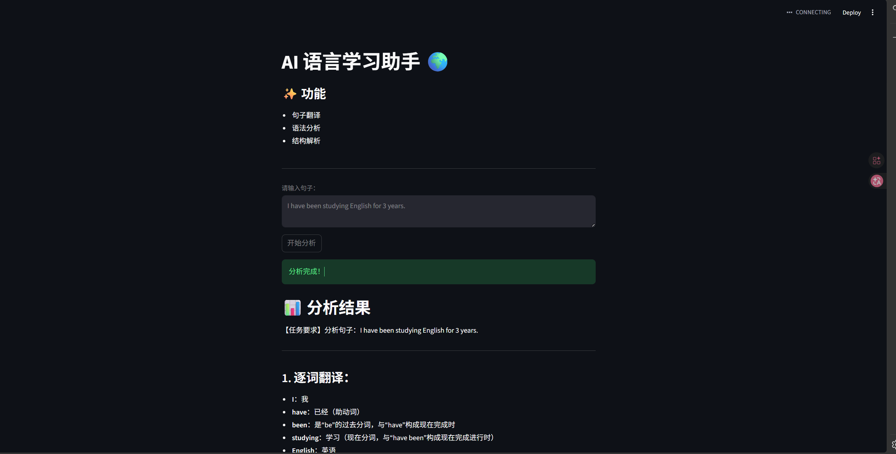

# 🌍 AI Language Learning Assistant

一个基于大模型的语言学习工具，支持句子翻译、词性分析和语法结构解析。

---

## 🚀 项目亮点

- ✨ 基于大模型实现语法分析
- 🌐 提供 Web 界面（Streamlit）
- 🧠 支持逐词翻译 + 句法解析
- 🕘 历史记录功能（提升用户体验）

---

## 📸 项目截图



---

## 🛠 技术栈

- Python
- Streamlit
- 阿里云通义千问（DashScope API）

---

## ▶️ 如何运行

```bash
pip install -r requirements.txt
streamlit run app.py
